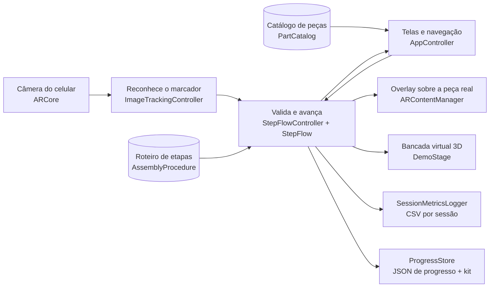
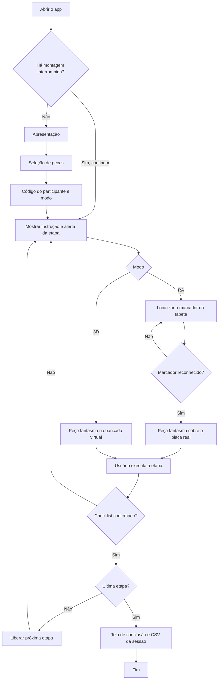
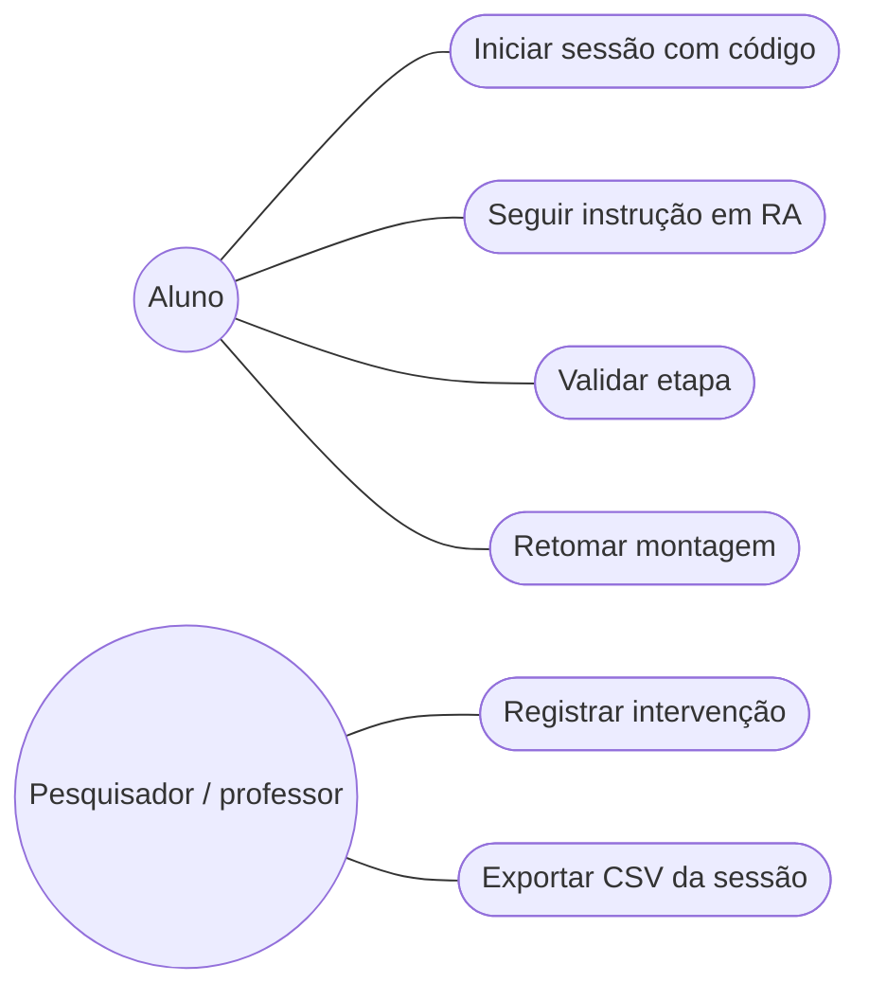

# MontAR

> **Realidade Aumentada com validação sequencial de etapas para a montagem de computadores**
> Projeto da Equipe Yupen na disciplina UPX: Realidade Aumentada (Centro Universitário Facens, 2026.2).


> **Estado atual (05/10/2026):** a fase de pesquisa foi concluída (artigo V1). O projeto Unity está configurado para Android com ARCore, a cena da prova de conceito está montada e a lógica do fluxo de etapas tem testes automatizados. O build Android é gerado sem erros, mas **o app ainda não foi testado em celular**. Tudo o que está marcado como planejado ainda não foi executado.

---

## 1. Identificação do Projeto

| Item | Informação |
|---|---|
| **Projeto** | MontAR |
| **Equipe** | Yupen |
| **Curso** | _a preencher_ |
| **Disciplina** | UPX: Realidade Aumentada |
| **Professor** | _a preencher_ |
| **Instituição** | Centro Universitário Facens, Sorocaba/SP |
| **Semestre** | 2026.2 |

### Integrantes

| Nome | RA | Responsabilidade |
|---|---|---|
| Enzo Zorzetto | _a confirmar_ | Pesquisa e experimento: estado da arte, protocolo experimental e análise de dados |
| Yuri Peruzzo | _a confirmar_ | Desenvolvimento AR: rastreamento, sobreposição 3D e fluxo de validação de etapas |
| Pedro Ricci Gomes Nascimento | _a confirmar_ | Produto e conteúdo: requisitos, interface, roteiro de montagem e documentação |

---

## 2. Visão Geral

O **MontAR** é um aplicativo Android de Realidade Aumentada que projeta a instrução de montagem sobre o computador real e **só libera a próxima etapa depois de confirmar a anterior**. Não usa óculos de RA nem hardware dedicado: funciona no celular que o aluno já tem.

O app é organizado em quatro ações:

| # | Ação | O que faz |
|---|---|---|
| 1 | **Aponta** | A câmera reconhece o componente e destaca o encaixe correto na placa |
| 2 | **Guia** | A instrução 3D fica sobre a peça real, com a orientação certa de encaixe |
| 3 | **Valida** | A próxima etapa só é liberada depois de confirmar que a anterior foi concluída |
| 4 | **Registra** | Marca cada etapa concluída e permite retomar a montagem de onde parou |

O aplicativo também é o **instrumento de uma pesquisa experimental**: ele será comparado com um manual técnico e com um tutorial em vídeo quanto à taxa de falhas de instalação, ao tempo de execução e à usabilidade (ver seção 4.3). Por isso, além de guiar a montagem, o app registra métricas de uso.

---

## 3. Problema

A montagem de computadores desktop é uma atividade procedimental: o estudante precisa identificar componentes, entender a posição de cada um e seguir a sequência correta de instalação. Manuais técnicos e tutoriais em vídeo apresentam a instrução **fora do equipamento**, e o estudante precisa alternar a atenção entre o material e a bancada, traduzindo uma representação 2D para o computador real.

Estudantes sem experiência erram principalmente em etapas que dependem de identificação e orientação espacial. Com componentes reais, alguns erros danificam o equipamento:

- **Pinos do soquete:** CPU mal assentada entorta pinos LGA e inutiliza a placa-mãe.
- **Conector trocado:** EPS de 12V e PCIe têm o mesmo número de pinos.
- **Orientação errada:** módulo de memória forçado no sentido invertido.

Na literatura, a RA reduz erros de montagem, mas o efeito sobre o tempo varia. Em Chu, Liao e Lin (2020), com RA em smartphone e confirmação de etapas, os erros caíram de 4,25 para 2,31 por montagem, mas o tempo subiu de 358 s para 782 s. Os autores atribuem parte desse custo ao **reconhecimento da peça**, e não à sobreposição. O MontAR trata esse gargalo como requisito de projeto.

---

## 4. Objetivos

### 4.1 Objetivo Geral

Desenvolver e avaliar uma aplicação móvel de Realidade Aumentada com validação sequencial de etapas para orientar a montagem física de computadores desktop, investigando seus efeitos sobre falhas de instalação, tempo de execução e usabilidade em comparação com manual técnico e tutorial em vídeo.

### 4.2 Objetivos Técnicos

- Configurar um projeto Unity com AR Foundation e ARCore para Android.
- Desenvolver uma prova de conceito de rastreamento e sobreposição de instruções sobre componentes reais.
- Implementar o fluxo sequencial de etapas, com avanço bloqueado até a validação da etapa atual.
- Manter o roteiro de montagem como dados editáveis, sem precisar alterar código.
- Registrar métricas de uso (tempos por etapa, tempo de confirmação, FPS e latência de rastreamento) e exportá-las em CSV.
- Executar testes técnicos de estabilidade do rastreamento, taxa de quadros e latência.
- Documentar instalação, execução, testes e limitações.

### 4.3 Questões de pesquisa e hipóteses

| ID | Questão |
|---|---|
| RQ1 | Qual o efeito das instruções em RA com validação sequencial sobre a **taxa de falhas de instalação**, comparado a manual técnico e tutorial em vídeo? |
| RQ2 | Qual o efeito sobre o **tempo de execução** da tarefa? |
| RQ3 | Quais dificuldades de interação serão observadas e como os participantes avaliarão a **usabilidade**? |

| ID | Hipótese |
|---|---|
| H1 | A condição RA terá menor taxa de falhas que manual e vídeo. |
| H2 | A validação sequencial poderá aumentar o tempo de execução, mesmo que a sobreposição facilite a identificação dos componentes. |
| H3 | A aplicação terá usabilidade adequada, medida pela System Usability Scale (SUS). |

O detalhamento está no artigo V1, em [`docs/documents/artigo-v1-montar.docx`](docs/documents/artigo-v1-montar.docx). Nenhum experimento foi realizado até o momento.

---

## 5. Público-Alvo

| Público | Perfil |
|---|---|
| Aluno iniciante | Primeira montagem, sem experiência prévia com hardware |
| Professor de laboratório | Atende vários alunos ao mesmo tempo em aula prática |
| Instituição de ensino | Quer reduzir componentes danificados e oferecer mais prática real |

**Contexto de uso:** bancada de laboratório, componentes reais, celular na mão.

---

## 6. Funcionalidades

| ID | Funcionalidade | Descrição | Status |
|---|---|---|---|
| RF01 | Iniciar sessão | Inicia a sessão com um código anônimo de participante | 🚧 |
| RF02 | Reconhecer referência (**Aponta**) | Reconhece a referência ou o componente da etapa atual | 🚧 |
| RF03 | Sobrepor instrução 3D (**Guia**) | Mostra o modelo 3D com a orientação correta de encaixe sobre a peça real | 🚧 |
| RF04 | Mostrar instrução e alerta | Exibe o texto da etapa e o alerta do erro comum daquela etapa | 🚧 |
| RF05 | Bloquear avanço (**Valida**) | Só libera a próxima etapa depois de validar a atual | 🚧 |
| RF06 | Salvar e retomar (**Registra**) | Salva o progresso e permite retomar de onde parou | 🚧 |
| RF07 | Registrar métricas | Grava o log de eventos da sessão e exporta em CSV | 🚧 |
| RF08 | Intervenção do observador | Botão discreto para o pesquisador registrar quando precisou intervir | 🚧 |
| RF09 | Tela de conclusão | Mostra o resumo da sessão ao final da montagem | 🚧 |
| RF10 | Apresentação | Explica como o app funciona (Aponta, Guia, Valida, Registra) antes de começar | 🚧 |
| RF11 | Seleção de peças | Escolha do modelo e da quantidade de cada peça; o roteiro se ajusta ao kit | 🚧 |
| RF12 | Demonstração 3D | Mostra o encaixe numa bancada virtual, sem câmera, com o mesmo overlay da RA | 🚧 |

**Legenda:** ✅ Implementado · 🚧 Em desenvolvimento · ⬜ Planejado · ❌ Cancelado

Nenhuma funcionalidade está marcada como ✅ porque nenhuma foi testada em celular. Todas as marcadas como 🚧 já têm código e interface. Em 07/10/2026, um teste automatizado no Editor percorreu o fluxo inteiro no modo demonstração 3D: apresentação, peças, início, as 9 etapas (com uma validação reprovada de propósito), conclusão e CSV (seção 22). A RA (RF02 e RF03) ainda não foi testada.

---

## 7. Requisitos Não Funcionais

| ID | Categoria | Requisito |
|---|---|---|
| RNF01 | Compatibilidade | Android com ARCore, celular na mão: sem óculos, sem tripé e sem hardware extra |
| RNF02 | Desempenho | Reconhecimento rápido da referência. A meta em segundos será definida na prova de conceito |
| RNF03 | Desempenho | Taxa de quadros estável durante o uso. A meta será definida e medida nos testes técnicos |
| RNF04 | Disponibilidade | Funcionar offline, sem depender de internet no laboratório |
| RNF05 | Privacidade | Não coletar dados pessoais (LGPD): apenas um código anônimo de participante |
| RNF06 | Desempenho | Overlays leves: modelos low-poly e texturas pequenas |
| RNF07 | Documentação | O repositório deve permitir que outra pessoa configure e execute o projeto |

---

## 8. Tecnologias Utilizadas

As versões abaixo foram conferidas em `ProjectSettings/ProjectVersion.txt` e `Packages/packages-lock.json`.

| Tecnologia | Versão | Utilização |
|---|---|---|
| Unity | 6000.6.4f1 | Motor 3D e lógica das etapas |
| C# | compatível com a Unity | Scripts da aplicação |
| Universal Render Pipeline | 17.6.0 | Renderização (perfil Mobile no Android) |
| Input System | 1.20.0 | Toque e interface |
| uGUI + TextMeshPro | 2.6.0 | Interface |
| Unity Test Framework | 1.8.0 | Testes automatizados da lógica de etapas |
| AR Foundation | 6.6.2 | Camada de abstração de RA |
| Google ARCore XR Plugin | 6.6.2 | Provedor de RA no Android |
| XR Plugin Management | 4.7.0 | Ativação do ARCore |
| XR Core Utils | 2.6.0 | `XROrigin` (dependência do AR Foundation) |
| Vuforia | _em avaliação_ | Alternativa caso o rastreamento por imagem não seja suficiente |
| Python + Pillow | 3.12 / 12.3 | Geração dos marcadores, das texturas da bancada e dos ícones da interface (`tools/`) |
| Blender | _a registrar_ | Modelagem dos componentes |
| Git + Git LFS | 2.55 / 3.7.1 | Controle de versão e arquivos binários grandes |
| GitHub | — | Hospedagem do código e da documentação |

---

## 9. Hardware Utilizado

| Equipamento | Modelo | Característica relevante | Utilização |
|---|---|---|---|
| Smartphone | _a definir_ | Android com suporte a ARCore | Desenvolvimento, testes e experimento (o mesmo aparelho em todas as sessões) |
| Computador (Yuri) | AMD Ryzen 7 9800X3D, 32 GB RAM, NVIDIA GeForce RTX 5070 Ti, Windows 11 Pro | Unity 6000.6.4f1 com Android Build Support | Desenvolvimento e build do APK |
| Kit de montagem | _a definir com o laboratório_ | Placa-mãe, CPU, RAM, GPU, fonte e gabinete | Tarefa de montagem do experimento |

Só serão listados aqui equipamentos efetivamente usados nos testes.

---

## 10. Arquitetura do Sistema

> Arquitetura **implementada** no protótipo em desenvolvimento. Ainda não foi testada em celular.

O roteiro de montagem é **orientado a dados**: cada etapa é um asset editável (ScriptableObject), porque o roteiro vai mudar com o kit real e com o levantamento de falhas. A lógica do fluxo fica em C# puro, testável sem a Unity em execução. Os componentes da cena (MonoBehaviours) apenas ligam essa lógica à câmera, à RA e à interface.



O kit escolhido na tela de peças filtra o roteiro (`StepFilter`): sem placa de vídeo, a etapa do PCIe sai; com 1 pente de RAM, a etapa usa o slot A2 em vez de A2 e B2.

### Fluxo resumido

```text
Usuário
   ↓
Interface (telas e checklist)
   ↓
Fluxo de etapas (StepFlow)
   ↓
AR Foundation
   ↓
ARCore
   ↓
Câmera / sensores do celular
   ↓
Bancada com os componentes reais
```

---

## 11. Funcionamento da Realidade Aumentada

### 11.1 Técnica utilizada

A técnica prevista é **Image Tracking** do AR Foundation. No Android, o ARCore não rastreia objetos 3D, apenas imagens e planos. Por isso, a proposta inicial é usar um **tapete de montagem impresso**, com o contorno da placa-mãe e marcadores nos cantos. O tapete define o referencial, e cada encaixe (soquete, slots de memória, PCIe, conectores) fica em uma posição conhecida para o modelo de placa usado.

A escolha final será feita na prova de conceito. Se o marcador não for suficiente, a alternativa é Vuforia Model Targets.

Para a prova de conceito foi criado o marcador `MontAR_Marcador_A`, de 15 cm, gerado por `tools/gerar_marcador.py`. Ele recebeu nota 100 na ferramenta `arcoreimg` do ARCore, que avalia a qualidade da imagem para rastreamento (o Google recomenda nota a partir de 75). A nota mede a imagem, não o desempenho no celular, que ainda será testado.

### 11.2 Fluxo técnico

1. O aplicativo inicia a sessão de RA e a câmera.
2. O ARCore procura a imagem de referência esperada para a etapa atual.
3. Ao reconhecer a referência, o app obtém sua posição e orientação.
4. O modelo 3D da etapa (peça "fantasma" e seta de orientação) é posicionado sobre o encaixe correto.
5. O usuário executa a etapa na bancada.
6. O app valida a etapa e, só então, libera a próxima.

### 11.3 Validação sequencial

Cada etapa passa pelos estados `Localizando → Guiando → Validando → Concluída`. Não é possível avançar sem passar pela validação. Os mecanismos de validação previstos, em camadas, são:

1. **Checklist guiado** por etapa (por exemplo, "a alavanca do soquete está travada?").
2. **Validação visual por marcador**, onde for viável: confirmar que o componente certo foi apontado ou que está na posição esperada.

O custo de tempo de cada camada será medido, porque é exatamente o que a hipótese H2 investiga.

### 11.4 Elementos virtuais

- modelo 3D translúcido do componente ("fantasma"), animado descendo até o encaixe correto;
- contornos amarelos no encaixe certo e vermelhos no errado (ex.: o segundo slot x16, que é x4);
- setas laranja indicando o gesto (empurrar na vertical, prender o parafuso);
- marcas de orientação (triângulo da CPU, chanfro da RAM e chave do slot);
- texto da instrução e alerta do erro comum da etapa;
- checklist de validação;
- indicador de progresso e da situação da etapa (procurando o marcador, guiando, conferindo).

Os overlays são feitos de formas simples (caixas, cilindros, setas), gerados a partir de `Assets/Dev/PreviewOverlay/spec_montagem.json`. As posições são de uma placa ATX **genérica** e valem como aproximação até o kit do laboratório ser definido.

### 11.5 Como o app mostra "como faz"

O app guia **em tempo real sobre a peça real**: com a câmera apontada para o tapete, a peça fantasma mostra o gesto no encaixe certo, o usuário repete com a peça dele e, no fim, confirma a etapa no checklist antes de liberar a próxima. Não existe uma etapa separada de "assistir e depois mostrar a peça para o app conferir". Os motivos:

- é a proposta do artigo: instrução sobre o computador real e validação sequencial;
- uma demonstração separada da execução vira um vídeo, que já é uma das condições de controle;
- o ARCore não reconhece a peça em si, só o marcador do tapete. Conferir a peça exigiria um marcador por componente ou visão computacional (decisões D1 e D2).

Para quando a câmera não ajuda (marcador fora de vista, aparelho sem ARCore), existe a **demonstração 3D**: a mesma animação numa bancada virtual que dá para girar com o dedo. O botão **Câmera | 3D** troca o modo durante a montagem, e a troca fica registrada no CSV (`mode_changed`). **A condição do experimento é a RA.**

### 11.6 Instrumentação para a pesquisa

O app grava um CSV por sessão em `Application.persistentDataPath/sessions/<session_id>.csv` (recuperado com `adb pull`), com um evento por linha. A gravação foi testada no Editor (testes automatizados e uma sessão completa no modo 3D), mas ainda não foi usada em celular.

```text
session_id, participant_code, app_version, device_model, step_index, step_id, event, t_ms, utc, fps_avg_1s, detail
```

| Grupo | Eventos |
|---|---|
| Sessão | `session_started`, `session_completed` |
| Etapa | `step_started`, `step_completed` |
| Rastreamento | `reference_detected`, `tracking_lost` |
| Validação | `validation_started`, `validation_passed`, `validation_failed`, `validation_cancelled` |
| Observador | `observer_intervention` |
| Modo | `mode_changed` (RA ↔ demonstração 3D) |
| Desempenho | `fps_sample` (a cada 5 s) |

O `detail` do `session_started` registra o modo inicial e o kit (ex.: `mode=ar;kit=placa_mae:atx_generica_lga1700:1|…|ram:ddr5_dimm:2|…`). Sessões no modo 3D devem ser separadas na análise, porque nelas a etapa não espera o marcador.

Desses eventos saem as medidas do artigo:

- **latência de rastreamento:** `reference_detected − step_started`;
- **tempo de confirmação:** `validation_passed − validation_started`;
- **tempo por etapa:** `step_completed − step_started`.

`t_ms` vem de um relógio monotônico. `utc` serve para cruzar com o vídeo da bancada e para ordenar sessões retomadas.

---

## 12. Estrutura do Projeto

```text
Upx8---Projeto-MONTAR/
│
├── Assets/
│   ├── Data/                       roteiro (Roteiro_bancada_v0), etapas (Steps/) e catálogo de peças (Pecas/)
│   ├── Dev/PreviewOverlay/         spec da montagem, gerador do conteúdo e cenas de prévia (fora do build)
│   ├── Editor/MontAR/              construtores da interface e da cena, exportador do roteiro
│   ├── Materials/                  materiais dos overlays e da bancada virtual
│   ├── Models/
│   ├── Prefabs/                    UI/MontAR_UI, Overlays/ (um por etapa), Bancada/ (placa genérica)
│   ├── Scenes/                     MontAR.unity
│   ├── Scripts/                    código do app (AR, Data, Flow, Metrics, Persistence, UI, Validation)
│   ├── Settings/                   perfis do URP
│   ├── Tests/                      EditMode/ (lógica) e PlayMode/ (fluxo de ponta a ponta)
│   ├── TextMesh Pro/               recursos do TextMeshPro
│   ├── Textures/                   ReferenceImages/ (marcadores), UI/ (ícones), Bancada/ (tapete e placa)
│   └── XR/                         configurações do XR Plug-in Management (ARCore)
│
├── Packages/
├── ProjectSettings/
│
├── docs/
│   ├── diagrams/
│   ├── documents/                  artigo, pitch, roteiro de montagem e demais documentos
│   │   └── marcadores/             PDFs para impressão dos marcadores
│   └── images/                     capturas das telas
│
├── tools/                          scripts auxiliares (marcadores, texturas da bancada, ícones da interface)
│
├── .gitattributes
├── .gitignore
├── CHANGELOG.md
├── README.md
└── README-PREENCHIMENTO.md
```

### Pastas principais

| Pasta | Finalidade |
|---|---|
| `Assets/Scripts` | Scripts produzidos pela equipe |
| `Assets/Data` | Roteiro, etapas (`Steps/Bancada`) e catálogo de peças (`Pecas`), editáveis sem alterar código |
| `Assets/Editor/MontAR` | Ferramentas de Editor: montam a interface e a cena e exportam o roteiro |
| `Assets/Scenes` | Cenas da aplicação |
| `Assets/Models` | Modelos 3D dos componentes (via Git LFS) |
| `Assets/Prefabs` | Overlays e objetos reutilizáveis |
| `Assets/Textures/ReferenceImages` | Marcadores e biblioteca de imagens de referência |
| `Assets/Tests` | Testes automatizados: EditMode (lógica) e PlayMode (fluxo completo na cena) |
| `docs/diagrams` | Diagramas técnicos |
| `docs/images` | Screenshots e figuras |
| `docs/documents` | Artigo, pitch e documentos complementares |
| `docs/documents/marcadores` | Marcadores prontos para imprimir (A4, tamanho real) |
| `docs/documents/roteiro-bancada-v0.md` | Roteiro exportado do app, base do manual técnico e do vídeo |
| `tools` | `gerar_marcador.py`, `gerar_texturas_previa.py` e `gerar_icones_ui.py` |

---

## 13. Principais Scripts

Todos os scripts ficam em `Assets/Scripts/`, no namespace `MontAR`. A lógica (fluxo, validação, CSV, progresso) é C# puro e tem testes automatizados. Os componentes de cena só fazem a ponte com a Unity e o AR Foundation.

| Script | Pasta | Responsabilidade | Testes |
|---|---|---|---|
| `ImageTrackingController.cs` | `AR/` | Recebe os eventos do `ARTrackedImageManager` e informa referências rastreadas e perdidas (Limited conta como perdida) | — |
| `ARContentManager.cs` | `AR/` | Instancia o overlay da etapa atual como filho da imagem rastreada, no offset definido na etapa | — |
| `PocDiagnosticsHud.cs` | `AR/` | Painel da prova de conceito: estado da sessão, FPS e medição do tempo até a detecção | — |
| `AssemblyStep.cs` / `AssemblyProcedure.cs` | `Data/` | Etapa e roteiro de montagem como dados editáveis no Inspector | — |
| `StepFlow.cs` | `Flow/` | Máquina de estados das etapas, com avanço bloqueado até validar | ✅ |
| `StepFlowController.cs` | `Flow/` | Liga o fluxo à cena: rastreamento, overlay, métricas e progresso | — |
| `ParticipantCode.cs` | `Flow/` | Validação do código anônimo do participante e id da sessão | ✅ |
| `ChecklistValidator.cs` / `ReferenceSeenValidator.cs` | `Validation/` | Validação por checklist e por marcador visto | ✅ |
| `SessionCsvLog.cs` / `SessionMetricsLogger.cs` / `FpsWindow.cs` | `Metrics/` | Log de eventos em CSV, gravação em disco e média de FPS | ✅ (CSV e FPS) |
| `ProgressStore.cs` | `Persistence/` | Salva e retoma o progresso (e o kit) em JSON | ✅ |
| `PartCatalog.cs` | `Data/` | Catálogo de peças: modelos e quantidades aceitas | ✅ (via seleção) |
| `PartSelection.cs` / `StepFilter.cs` | `Flow/` | Kit escolhido e filtro das etapas pelo kit | ✅ |
| `GuidanceMode.cs` | `Flow/` | Modo RA ou demonstração 3D | ✅ |
| `SessionSummary.cs` | `Metrics/` | Resumo da tela de conclusão (tempos, reprovações, intervenções) | ✅ |
| `DemoStage.cs` | `AR/` | Bancada virtual da demonstração 3D, com câmera orbital | ✅ (PlayMode) |
| `AppController.cs` | `UI/` | Navegação entre telas, câmeras, verificação do ARCore, retomada | ✅ (PlayMode) |
| `WelcomeScreen`, `PartsScreen`, `StartScreen`, `AssemblyScreen`, `CompletionScreen` | `UI/` | As cinco telas do app | ✅ (PlayMode) |
| `AppBuilder.cs` / `RoteiroExporter.cs` / `BatchTasks.cs` | `Assets/Editor/MontAR/` | Geram a interface e a cena, exportam o roteiro e rodam tarefas em linha de comando | — |

Ainda falta o `InteractionController` (toques na cena de RA).

---

## 14. Dependências

Dependências principais em `Packages/manifest.json`:

```text
com.unity.xr.arfoundation            6.6.2
com.unity.xr.arcore                  6.6.2
com.unity.render-pipelines.universal 17.6.0
com.unity.inputsystem                1.20.0
com.unity.ugui                       2.6.0
com.unity.test-framework             1.8.0
```

O `com.unity.xr.management` (4.7.0) e o `com.unity.xr.core-utils` (2.6.0) entram como dependências do ARCore e do AR Foundation.

Outros pacotes no manifest:

- `com.unity.ai.inference`: mantido para uma possível exploração de reconhecimento por visão computacional;
- `com.coplaydev.unity-mcp`: ferramenta de desenvolvimento que conecta o Editor ao assistente de código.

---

## 15. Configuração do Ambiente

### Pré-requisitos

- Windows 10 ou 11;
- Unity Hub;
- Unity **6000.6.4f1** com o módulo **Android Build Support** (OpenJDK, Android SDK e NDK);
- Git e **Git LFS**;
- celular Android com suporte a ARCore (Google Play Services for AR).

### Procedimento

1. Instale o Unity Hub e, por ele, a Unity 6000.6.4f1 com o módulo **Android Build Support** (marque OpenJDK e Android SDK & NDK Tools).
2. Instale o Git e o Git LFS e execute `git lfs install` uma vez na máquina.
3. Clone o repositório (seção 16).
4. Abra o projeto pelo Unity Hub e aguarde a importação dos pacotes.
5. Em **Build Profiles**, confirme a plataforma **Android** (o projeto já é salvo com ela ativa).
6. Em **Project Settings › XR Plug-in Management › Project Validation**, confira se não há pendências na aba Android.

O projeto já está configurado: ARCore ativo no Android, IL2CPP, ARM64, API mínima 29 e os renderer features do AR no `Mobile_Renderer`.

> **Windows com Smart App Control:** nesse modo, o Windows bloqueia a DLL do XR Simulation e o cache do Burst, então o modo Play no Editor não simula a RA. O teste de RA é feito no celular. Ver seção 29.

> Este procedimento ainda será testado em uma segunda máquina.

---

## 16. Como Executar

```bash
git lfs install
git clone https://github.com/yuri-pro07/Upx8---Projeto-MONTAR.git
cd Upx8---Projeto-MONTAR
git lfs pull
```

Depois:

1. Abra o Unity Hub.
2. Clique em **Add › Add project from disk** e selecione a pasta clonada.
3. Confirme a versão 6000.6.4f1.
4. Abra a cena principal `Assets/Scenes/MontAR.unity` (é a única cena do build).
5. Em **Build Profiles**, confirme a plataforma Android.
6. Ative a depuração USB no celular e conecte-o ao computador.
7. Execute **Build and Run**.

O APK foi gerado com sucesso em 05/10/2026 (prova de conceito) e em 07/10/2026 (app completo), mas ainda não foi instalado em nenhum celular. Esta seção será atualizada com o procedimento validado no aparelho.

Sem celular, dá para usar o app no próprio Editor: dê Play na cena `MontAR.unity` e escolha **Demonstração 3D** na tela de início.

### Marcador da prova de conceito

Imprima `docs/documents/marcadores/MontAR_Marcador_A_15cm_A4.pdf` em **100% (tamanho real)**, sem "ajustar à página", e confira com uma régua: a borda externa da moldura preta deve medir 15 cm. Se o tamanho estiver errado, o overlay aparece em escala errada.

---

## 17. Como Utilizar a Aplicação

### Prova de conceito (build atual)

1. Abra o aplicativo e autorize o acesso à câmera.
2. Aponte a câmera para o marcador A impresso, sobre a mesa.
3. Confira se o contorno amarelo coincide com a borda preta do marcador e se o overlay fica estável ao mover o celular.
4. Para medir o tempo de detecção, afaste a câmera do marcador, toque em **Medir detecção** e aponte para o marcador. O painel mostra a média e as últimas amostras.

### Aplicativo completo

> Fluxo implementado e testado no Editor (modo demonstração 3D). Ainda não foi testado no celular.

1. Abra o aplicativo e autorize o acesso à câmera.
2. Leia a **apresentação** (ou toque em **Pular**). Se houver uma montagem interrompida, o app pergunta se você quer continuar.
3. Na tela de **peças**, confira o kit: modelo e quantidade de cada peça. Peças opcionais podem ficar de fora, e o roteiro se ajusta.
4. Na tela de **início**, digite o código do participante (ex.: `P01`), escolha **Câmera (RA)** ou **Demonstração 3D** e toque em **Iniciar montagem**.
5. Na montagem, aponte a câmera para o marcador A do tapete. A peça fantasma mostra onde e como encaixar.
6. Execute a etapa com a peça real e toque em **Validar etapa**. Marque os itens que conferem e toque em **Confirmar**. Se algum item ficar desmarcado, a etapa volta para correção.
7. Repita até a última etapa e confira o resumo na tela de conclusão.

Para o pesquisador:

- o toque longo (1,2 s) no círculo do canto superior direito, durante a montagem, registra uma **intervenção do observador**;
- o toque longo (2 s) na versão, na apresentação, liga o painel de diagnóstico da prova de conceito;
- o CSV da sessão fica em `sessions/` dentro da pasta de dados do app e é copiado com `adb pull`.

---

## 18. Fluxo de Funcionamento



---

## 19. Caso de Uso



Os diagramas em SVG (`docs/diagrams/caso-de-uso.svg`, `arquitetura.svg` e `fluxo-ra.svg`) serão produzidos na prova de conceito.

---

## 20. Fluxo de Navegação

```text
Apresentação (como funciona)          ← pergunta se quer continuar uma montagem interrompida
    ↓
Seleção de peças (modelo e quantidade)
    ↓
Início (código do participante + Câmera RA ou Demonstração 3D)
    ↓
Montagem: etapa atual (instrução + alerta) e peça fantasma (RA ou 3D)
    ↓
Checklist de validação
    ↓
Próxima etapa  (repete até a última)
    ↓
Conclusão (resumo da sessão)  →  Nova montagem / Voltar ao início
```

---

## 21. Interface

Capturas reais do app **no Editor**, no modo demonstração 3D, feitas pelo teste automatizado de 07/10/2026. Não são capturas do celular nem da RA, que ainda não foi testada.

| Apresentação | Peças | Início |
|---|---|---|
|  |  |  |

| Montagem (CPU, 3D) | Montagem (RAM, 3D) | Validação | Conclusão |
|---|---|---|---|
|  |  |  |  |

A captura da experiência de RA (`experiencia-ra.png`) será adicionada depois do teste no celular.

---

## 22. Testes Técnicos

### 22.1 Testes realizados

| Teste | Procedimento | Resultado esperado | Resultado obtido | Status |
|---|---|---|---|---|
| Testes automatizados (05/10/2026) | Rodar os testes EditMode de `MontAR.Tests.EditMode` no Test Runner | Todos os testes passam | 41 de 41 aprovados: fluxo de etapas, CSV, validação, progresso, código de participante e FPS | ✅ |
| Build Android (05/10/2026) | Gerar o APK pelo Build Profiles (IL2CPP, ARM64) | APK gerado sem erros | APK de 45 MB gerado, 0 erros | ✅ |
| Validação do projeto XR (05/10/2026) | XR Plug-in Management › Project Validation, abas Android e Desktop | Nenhuma pendência | Nenhuma pendência | ✅ |
| Qualidade do marcador A (05/10/2026) | `arcoreimg eval-img` no PNG do marcador | Nota ≥ 75 (recomendação do Google) | Nota 100 | ✅ |
| Testes automatizados (07/10/2026) | Testes EditMode em linha de comando (`-runTests -testPlatform EditMode`) | Todos os testes passam | 62 de 62 aprovados, incluindo kit de peças, filtro de etapas, modo 3D e resumo da sessão | ✅ |
| Build Android do app completo (07/10/2026) | `BatchTasks.BuildAndroid` em linha de comando (IL2CPP, ARM64) | APK gerado sem erros | APK de 46,7 MB, 0 erros, 2 min 26 s | ✅ |
| Fluxo completo no Editor (07/10/2026) | Teste PlayMode na cena `MontAR.unity`, modo 3D: apresentação, peças (tirar e repor a placa de vídeo, 1 e 2 pentes), código inválido e válido, 9 etapas com 1 validação reprovada, conclusão | Chega à conclusão e o CSV tem o kit, o modo, a reprovação e as 9 etapas | Aprovado (cerca de 13 s) | ✅ |

### 22.2 Testes planejados em celular

| Teste | Procedimento | Resultado esperado | Resultado obtido | Status |
|---|---|---|---|---|
| Inicialização | Abrir o aplicativo no celular | Aplicação inicia e pede permissão da câmera | — | ⬜ |
| Detecção da referência | Apontar para o tapete/marcador em luz de laboratório | Referência detectada dentro da meta de tempo | — | ⬜ |
| Estabilidade do rastreamento | Mover o celular ao redor da bancada | Overlay permanece alinhado ao encaixe | — | ⬜ |
| Taxa de quadros | Registrar FPS durante uma montagem completa | FPS dentro da meta definida | — | ⬜ |
| Latência de rastreamento | Medir `referência detectada − início da etapa` | Latência dentro da meta definida | — | ⬜ |
| Bloqueio de avanço | Tentar avançar sem validar | Próxima etapa permanece bloqueada | — | ⬜ |
| Retomada | Fechar e reabrir o app no meio da montagem | Montagem retoma na etapa salva | — | ⬜ |
| Exportação CSV | Concluir uma sessão e copiar o arquivo com `adb pull` | CSV completo com todos os eventos | — | ⬜ |

---

## 23. Dispositivos Testados

| Dispositivo | Sistema | Versão | Resultado |
|---|---|---|---|
| — | — | — | Nenhum dispositivo testado até o momento |

---

## 24. Limitações Conhecidas

Limitações identificadas no planejamento, a confirmar nos testes:

- o ARCore não reconhece objetos 3D no Android, então o reconhecimento depende de marcadores impressos;
- os encaixes são posicionados em relação ao tapete, o que vale para um modelo específico de placa-mãe;
- a validação por checklist depende da confirmação do próprio usuário;
- a montagem exige as duas mãos, e o celular não usa tripé: o usuário precisa alternar entre segurar o aparelho e executar a etapa;
- a validação de cada etapa pode aumentar o tempo total da montagem (hipótese H2);
- a placa-mãe e os overlays usam uma placa ATX **genérica**, com posições aproximadas, até o kit do laboratório ser definido;
- por enquanto há só uma opção de cada peça e a montagem é em bancada, sem gabinete;
- no modo demonstração 3D a etapa não espera o marcador, então essas sessões não servem para medir a latência de rastreamento.

---

## 25. Evidências de Funcionamento

Até agora, só evidências no Editor: as capturas da seção 21 e o resultado dos testes automatizados da seção 22. As imagens da experiência de RA e o vídeo de demonstração serão adicionados depois do teste no celular.

---

## 26. Repositórios e Recursos

| Recurso | Link |
|---|---|
| Código-fonte | https://github.com/yuri-pro07/Upx8---Projeto-MONTAR |
| Repositório-modelo da disciplina | https://github.com/dr-ohata/upx-modelo |
| Artigo V1 | [`docs/documents/artigo-v1-montar.docx`](docs/documents/artigo-v1-montar.docx) |
| Pitch | [`docs/documents/pitch-montar.pptx`](docs/documents/pitch-montar.pptx) |
| Figma | _a definir_ |
| Trello/Jira | _a definir_ |
| Vídeo de demonstração | _a publicar_ |

---

## 27. Cronograma Técnico

| Atividade | Responsável | Período | Status |
|---|---|---|---|
| Pesquisa e estado da arte (artigo V1) | Equipe | 10/09 – 05/10 | ✅ |
| Estrutura do repositório e configuração do projeto | Yuri | 05/10 | ✅ |
| Prova de conceito: rastreamento e sobreposição | Yuri | 05/10 – ~19/10 | 🚧 |
| Lógica do fluxo de etapas, métricas e progresso (com testes) | Yuri | 05/10 | 🚧 |
| Roteiro de montagem e requisitos | Pedro | 06/10 – ~19/10 | ⬜ |
| Protótipo: fluxo de etapas, validação e métricas | Yuri | ~20/10 – 09/11 | ⬜ |
| Interface | Pedro | ~20/10 – 09/11 | 🚧 (primeira versão pronta em 07/10) |
| Manual técnico e tutorial em vídeo (condições de controle) | Pedro e Enzo | ~20/10 – 09/11 | ⬜ |
| Protocolo experimental e instrumentos (checklist de falhas, SUS) | Enzo | ~20/10 – 09/11 | ⬜ |
| **Congelamento do protótipo** | Equipe | 09/11 | ⬜ |
| Experimento: coleta e análise de dados | Equipe (análise: Enzo) | 10/11 – 01/12 | ⬜ |
| Apresentação final | Equipe | 03/12 | ⬜ |

A divisão entre prova de conceito e protótipo em ~19/10 é uma proposta da equipe. Esforço estimado: 3 integrantes × 16 semanas × 6 h semanais = **288 h**.

---

## 28. Controle de Versão

Os commits seguem o padrão do modelo, com descrição no presente em português:

```text
feat: adiciona validação por checklist na etapa da CPU
fix: corrige posicionamento do overlay da memória RAM
docs: atualiza instruções de execução
test: adiciona testes do fluxo de etapas
chore: atualiza pacotes do AR Foundation
refactor: separa o registro de métricas do controlador de etapas
```

- `main` sempre compila. Funcionalidades são desenvolvidas em `feat/<nome-curto>` e integradas depois de testadas no Editor.
- Commits pequenos e frequentes, para registrar a evolução do projeto.
- Modelos 3D (`.fbx`, `.blend`) passam pelo Git LFS.
- Builds (`.apk`, `.aab`) e keystores não são versionados. Os builds são publicados em GitHub Releases.
- O [CHANGELOG](CHANGELOG.md) registra uma versão por marco do projeto.

---

## 29. Problemas Encontrados e Soluções

### Problema 1: XR Simulation não funciona no Editor

**Problema:** no modo Play, o console mostra `DllNotFoundException: XRSimulationSubsystem` e a RA não é simulada.
**Causa:** o **Smart App Control** do Windows 11 bloqueia a DLL nativa do XR Simulation (`XRSimulationSubsystem.dll`) e as DLLs geradas pelo Burst em `Library/BurstCache`.
**Solução:** o teste de RA passou a ser feito direto no celular. Não desligamos o Smart App Control, porque no Windows 11 isso não pode ser revertido sem reinstalar o sistema. Em máquinas sem esse bloqueio, o XR Simulation já está configurado. Para testar o fluxo sem RA, o app ganhou o modo demonstração 3D.
**Observação (07/10/2026):** nos testes PlayMode rodados em linha de comando, o XR Simulation carregou normalmente (`ARSession: Ready`). Ainda falta conferir no Editor com interface.

### Problema 2: erro ao rastrear imagem que não está na biblioteca

**Problema:** `ArgumentNullException` em `ImageTrackingController` durante o modo Play.
**Causa:** o provedor de RA entregou uma imagem rastreada sem referência na `XRReferenceImageLibrary`, com nome nulo, e o nome era usado como chave de dicionário.
**Solução:** imagens sem nome agora são ignoradas, com um aviso no console.

### Problema 3: marcador com tamanho físico ambíguo

**Problema:** a primeira versão do marcador tinha uma margem branca por fora da moldura preta. Impresso com 15 cm, a moldura mediria cerca de 13,8 cm.
**Causa:** o ARCore usa o tamanho da imagem inteira, incluindo a margem, que some no papel branco.
**Solução:** a moldura passou a encostar na borda da imagem. Agora a borda preta impressa mede exatamente o tamanho declarado na biblioteca (15 cm), o mesmo do contorno amarelo do overlay.

### Problema 4: botão Validar travado em etapas sem marcador

**Problema:** no teste de ponta a ponta, a partir da 2ª etapa do modo 3D o botão **Validar etapa** ficava desabilitado.
**Causa:** o `StepFlow` emitia `step_started` com a fase "Localizando" e só depois passava para "Guiando", sem novo evento. A interface atualiza no evento e ficava com a fase antiga. O mesmo aconteceria na RA com a etapa sem marcador (verificação final).
**Solução:** a fase é decidida antes do `step_started`. Um teste EditMode cobre o caso.

### Problema 5: referências nulas ao montar a cena por script

**Problema:** o catálogo e o roteiro ficavam vazios no `AppController` e no `StepFlowController` depois de montar a cena pelo construtor.
**Causa:** abrir uma cena pelo `EditorSceneManager` descarrega da memória os assets sem uso, e a referência guardada antes virava nula.
**Solução:** o construtor carrega o catálogo, o roteiro e o prefab pelo caminho, depois de abrir a cena.

---

## 30. Melhorias Futuras

- reconhecimento do componente sem marcador (Vuforia Model Targets ou modelo de visão computacional);
- validação visual automática da posição de cada componente;
- roteiros para outros modelos de placa-mãe e gabinete;
- painel para o professor acompanhar vários alunos na mesma aula;
- suporte a iOS (ARKit).

---

## 31. Custos e Recursos

| Recurso | Tipo | Custo/Condição |
|---|---|---|
| Esforço da equipe | Pessoas | 288 h estimadas (3 × 16 semanas × 6 h) |
| Unity | Software | Conforme licença utilizada pela equipe |
| AR Foundation e ARCore | Software | Gratuitos |
| Vuforia | Software | Licença a verificar, caso seja adotado |
| Blender | Software | Gratuito |
| Smartphone Android com ARCore | Hardware | Equipamento da equipe |
| Computador de desenvolvimento | Hardware | Equipamento da equipe |
| Kit de componentes para montagem | Hardware | Laboratório da instituição (a confirmar) |
| Impressão do tapete de montagem e marcadores | Material | Baixo custo, a estimar |

---

## 32. Licença

Projeto acadêmico desenvolvido para fins educacionais na disciplina UPX: Realidade Aumentada, do Centro Universitário Facens.

---

## 33. Autores

- **Enzo Zorzetto**: pesquisa e experimento
- **Yuri Peruzzo**: desenvolvimento AR
- **Pedro Ricci Gomes Nascimento**: produto, conteúdo e documentação

**Instituição:** Centro Universitário Facens
**Disciplina:** UPX: Realidade Aumentada
**Semestre:** 2026.2

---

## Checklist de Entrega

- [ ] Código-fonte atualizado
- [ ] README completamente preenchido
- [ ] Versões das tecnologias registradas
- [ ] Arquitetura apresentada
- [ ] Funcionamento da RA explicado
- [ ] Estrutura de pastas documentada
- [ ] Scripts principais descritos
- [ ] Procedimento de instalação testado
- [ ] Procedimento de execução testado
- [ ] Screenshots reais adicionados
- [ ] Testes registrados
- [ ] Dispositivos testados informados
- [ ] Limitações conhecidas documentadas
- [ ] Evidência de funcionamento adicionada
- [ ] Commits representam a evolução do projeto
